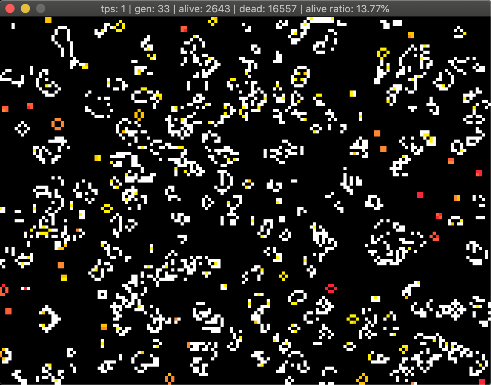

# Game of Life

An implementation of Conway's Game of Life using Go and Ebiten.

- [Conway's Game of Life wiki](https://en.wikipedia.org/wiki/Conway%27s_Game_of_Life)
- [Ebiten - A dead simple 2D game library for Go](https://ebiten.org/)

## Getting Started

```
$ go run main.go world.go
```

### Key Bindings

| Key(s)         | Description                    |
| -------------- | -------------------------------|
| CTRL + P       | Randomly populates the world   |
| CTRL + R       | Resets the world               |
| UP / DOWN      | Increase or decrease TPS       |
| H + Left Click | Inserts a [Heavyweight Spaceship](https://en.wikipedia.org/wiki/Conway%27s_Game_of_Life#/media/File:Animated_Hwss.gif) |

## Screenshots


